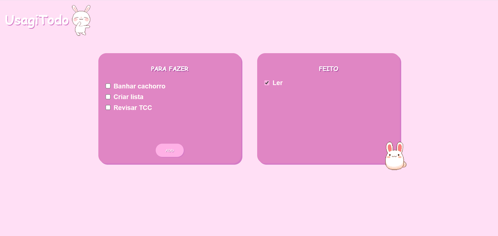

# UsagiTODO

UsagiTODO is a desktop task management application built with Electron, HTML, CSS and JavaScript.

The project was created to practice desktop application development, DOM manipulation, user interface design and task organization features.

## Features

- Add new tasks
- Mark tasks as completed
- Separate pending and completed tasks
- Desktop application built with Electron
- Custom visual interface
- Simple and intuitive task management

## Technologies Used

- Electron
- HTML5
- CSS3
- JavaScript
- Node.js
- Git
- GitHub

## Project Structure

```text
usagi-todo/
│
├── assets/
├── index.html
├── main.js
├── script.js
├── style.css
├── package.json
├── package-lock.json
├── README.md
├── LICENSE
└── .gitignore
```

## How to Run

Follow the steps below to run the project on your machine.

### 1. Clone the repository

```bash
git clone https://github.com/SthefaniaDev/usagi-todo.git
```

### 2. Access the project folder

```bash
cd usagi-todo
```

### 3. Install dependencies

```bash
npm install
```

### 4. Run the application

```bash
npm start
```

## Project Preview

Add a screenshot of the application here.

```markdown

```

## Purpose

This project was developed to practice building desktop applications using Electron and front-end technologies. It also explores basic task management logic, interface design and project organization.

## Future Improvements

- Save tasks locally
- Add task editing
- Add task deletion
- Add due dates
- Add task categories
- Add dark mode
- Improve responsiveness
- Package the application as an executable file

## Author

Developed by **Sthefania Ferreira**.

- GitHub: https://github.com/SthefaniaDev
- LinkedIn: https://www.linkedin.com/in/sthefania-ferreira
